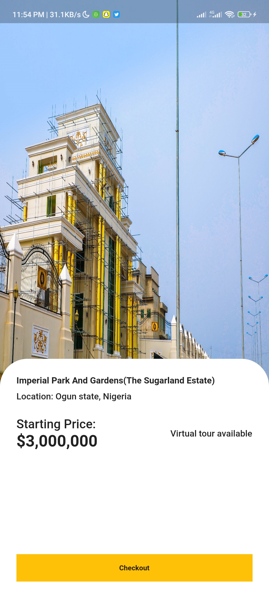

# Real Estate UI Kit🔥  

A Real Estate UI kit written with flutter. In collaboration with a UI/UX designer.

Star⭐ the repo if you like what you see😉.

## ✨ Requirements

- Any Operating System (ie. MacOS X, Linux, Windows)
- Any IDE with SDK installed (ie. IntelliJ, Android Studio, VSCode etc)
- A little knowledge of Flutter and dart

## 📸 ScreenShots

    
    
    

## 🌗 Dark theme

Adapts to device theme

## 🤓 Author(s)

**Olaifa Glory Israel** 

## 🔖 LICENCE

[WTFPL](http://www.wtfpl.net/about/)